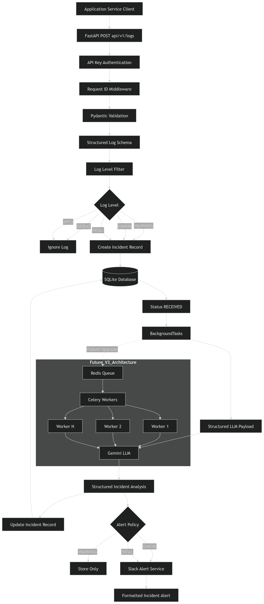

# InsightLog (v3)


**InsightLog** is a fast, asynchronous, AI-powered AIOps microservice built for modern SRE teams. It ingests raw application and system logs, intelligently categorizes them using Google Gemini, extracts root causes and remediation steps, and automatically alerts your team on Slack for critical issues.

---

## 🏗️ Architecture Overview

Following Domain-Driven Design (DDD) principles, the v2 architecture strictly separates internal business logic from external API integrations.

- **API Layer (`app/api/`):** Thin FastApi routers handling HTTP validation and rate limiting.
- **Service Layer (`app/services/`):** Core business logic handling the lifecycle of incidents (RECEIVED → PROCESSING → COMPLETED/FAILED).
- **Integrations Layer (`app/integrations/`):** Safely isolated wrappers for blocking external I/O (Gemini API, Slack Webhooks).
- **Data Layer (`app/database/`, `app/models/`):** SQLAlchemy ORM models mapped to an asynchronous-ready interface (currently backed by SQLite).

---

## 🛠️ Tech Stack

- **Framework:** [FastAPI](https://fastapi.tiangolo.com/) (Python 3.10+)
- **Database:** SQLite with SQLAlchemy ORM
- **AI/LLM:** Google Gemini 2.5 Flash SDK (with structured JSON outputs)
- **Validation:** Pydantic v2
- **Rate Limiting:** `slowapi`
- **Testing:** `pytest` (100% Core coverage)

---

## 🚀 Setup & Run Instructions

### 1. Prerequisites
- Python 3.10+
- Google Gemini API Key

### 2. Installation
Clone the repository and set up the virtual environment:
```bash
git clone https://github.com/manavsoni05/InsightLog.git
cd InsightLog
python -m venv venv

# On Windows:
venv\Scripts\activate
# On macOS/Linux:
source venv/bin/activate
```

### 3. Dependencies & Config
Install requirements and prepare the environment file:
```bash
pip install -r requirements.txt
cp .env.example .env
```
*(Make sure to open `.env` and add your real `GEMINI_API_KEY`, `SLACK_WEBHOOK_URL`, and secure `API_KEY`!)*

### 4. Run the Server
```bash
uvicorn app.main:app --reload
```
The API is now running at `http://127.0.0.1:8000`. 
Interactive Swagger docs are available at `http://127.0.0.1:8000/docs`.

---

## 🔌 API Endpoints

| Method | Endpoint | Description |
|--------|----------|-------------|
| **POST** | `/api/v1/logs` | Ingests a new log and returns an immediate tracking `receipt_id`. |
| **GET**  | `/api/v1/logs/{receipt_id}` | Poll the triage result using the returned tracking ID. |

*(All endpoints require the `X-API-Key` header for authentication).*

---

## 🧪 Real-world Sample Test Cases (Curl)

*Note: V3 implements strict timestamp validation. Replace the `datetime` values below with a timestamp within 5 minutes of your current time, or the API will reject it!*

### 1. INFO Level (Ignored/Filtered)
```bash
curl -X POST "http://127.0.0.1:8000/api/v1/logs" \
  -H "X-API-Key: insightlog-dev-secret-changeme" \
  -H "Content-Type: application/json" \
  -d '{
    "datetime": "2026-06-03T18:00:00",
    "log_level": "INFO",
    "message": "Admin user successfully changed their password."
  }'
```
*(Returns 202 Accepted - Short-circuits the LLM and database to save costs since it is just INFO)*

### 2. WARNING Level (Security/Application)
```bash
curl -X POST "http://127.0.0.1:8000/api/v1/logs" \
  -H "X-API-Key: insightlog-dev-secret-changeme" \
  -H "Content-Type: application/json" \
  -d '{
    "datetime": "2026-06-03T18:05:00",
    "log_level": "WARNING",
    "message": "Multiple failed login attempts detected from single IP address",
    "details": {"ip": "192.168.1.50"}
  }'
```
*(Processed by LLM and saved to DB, but does NOT trigger a Slack alert)*

### 3. ERROR / FATAL Level (Database Outage)
```bash
curl -X POST "http://127.0.0.1:8000/api/v1/logs" \
  -H "X-API-Key: insightlog-dev-secret-changeme" \
  -H "Content-Type: application/json" \
  -d '{
    "datetime": "2026-06-03T18:10:00",
    "log_level": "FATAL",
    "message": "Postgres replica sync failed. Write-ahead log corruption detected.",
    "error": "DataCorruptionError: WAL segment missing",
    "details": {"region": "us-east-1"}
  }'
```
*(Processed by LLM and Triggers a Richly Formatted Slack Alert)*

### 4. Invalid Payload (Future Timestamp Rejection)
```bash
curl -X POST "http://127.0.0.1:8000/api/v1/logs" \
  -H "X-API-Key: insightlog-dev-secret-changeme" \
  -H "Content-Type: application/json" \
  -d '{
    "datetime": "2099-01-01T00:00:00",
    "log_level": "ERROR",
    "message": "This log is from the future"
  }'
```
*(Returns 422 Unprocessable Entity - clock skew validation failure)*

### 5. Authentication Failure
```bash
curl -X POST "http://127.0.0.1:8000/api/v1/logs" \
  -H "X-API-Key: WRONG_KEY" \
  -H "Content-Type: application/json" \
  -d '{
    "datetime": "2026-06-03T18:00:00",
    "log_level": "ERROR",
    "message": "Test log message"
  }'
```
*(Returns 401 Unauthorized)*

---

## ✨ Improvements in V3 (Production Pipeline)

| Feature | V2 | V3 (Current) |
|---------|----|----|
| **Input Schema** | Unstructured `message` string | Structured `datetime`, `log_level`, `message`, `error`, `details` |
| **Noise Filtering** | Processed all logs | Edge-layer short-circuiting for `DEBUG`/`INFO` (No DB, No LLM) |
| **Slack Alerts** | Alerted on all incidents | Smart Routing: Alerts ONLY on `ERROR` and `FATAL` logs |
| **Alert Formatting** | Basic text | Rich UI (Icons, visual dividers, parsed bullet point lists) |
| **Data Validation** | Basic string checks | Strict time validation (±5 min clock skew limit, 7-day past bounds) |
| **LLM Context** | Sent only the message | Sends the entire rich JSON payload to Gemini for better context |

| Feature | V1 | V2 |
|---------|----|----|
| **Security** | None | HMAC timing-safe API Key Authentication |
| **Stability** | Dropped connections on failure | 3-attempt Exponential Backoff on Gemini API |
| **Rate Limiting** | None | `slowapi` 30 req/min limits |
| **Folder Structure**| Mixed external & internal logic | Clean `integrations/` vs `services/` separation |
| **Testing** | Non-existent | 80+ Pytest Suite (Coverage for LLM Mocks, Schemas, Auth) |
| **Database** | Missing critical indexes | Created indexes for `status` and `created_at` polling |

## Architecture Diagram



---

## 🚧 Current Limitations

- **Asynchronous Execution:** Currently, the system leverages FastAPI's built-in `BackgroundTasks` via thread pools. It does **not** yet use Celery or Redis for distributed worker queues. While perfectly stable for moderate traffic, heavy parallel I/O blocking from Gemini can saturate the application backend.
- **Database Backend:** SQLite file locking on Windows can cause slight concurrency delays at very high request volumes.

---

## 🔮 Future Enhancements

- **Celery + Redis Worker Queue:** Decouple the HTTP API layer from the background LLM processing by implementing a true distributed message broker.
- **PostgreSQL Migration:** Move to a robust relational database with `PgBouncer` connection pooling to handle 10,000+ alerts per minute safely.
- **Observability Metrics:** Add Prometheus metric scraping and a Grafana dashboard to track Gemini token usage, average latency, and API HTTP error rates.
- **Advanced LLM Fallbacks:** Implement routing to Claude 3.5 or OpenAI GPT-4o if the Gemini API goes down or exhausts daily quota.
